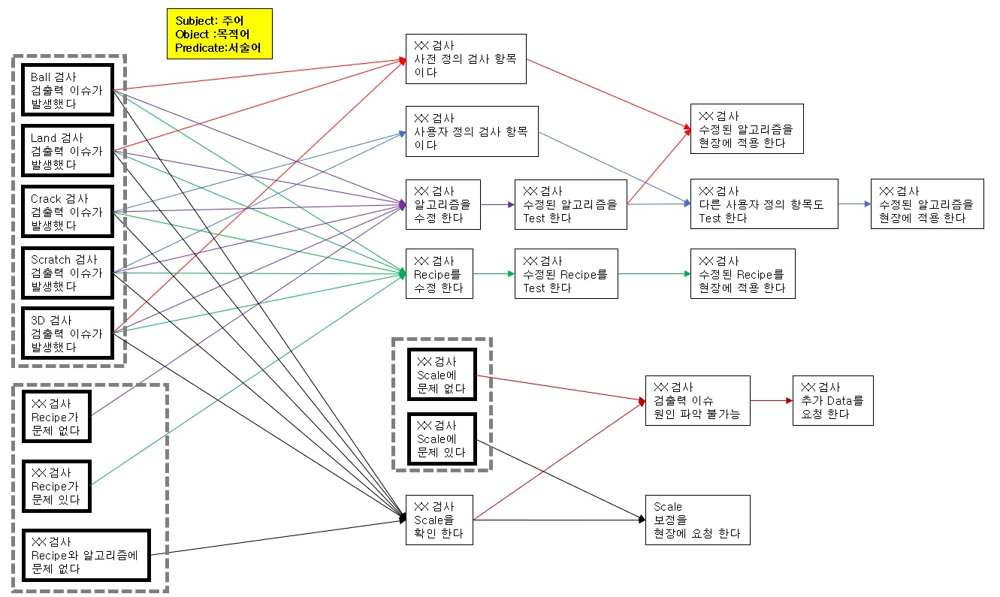
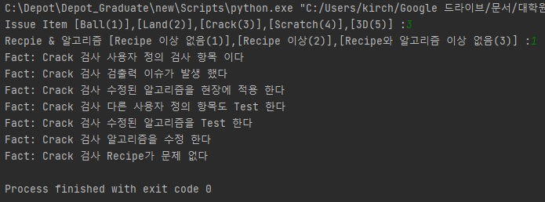

# ** 산업인공지능 개론 1st Project** 

- Durable Rule 패키지를 사용하여 현업의 문제 해결을 위한 규칙을 15개 이상 만들어서 실행될 수 있는 시스템을 구성하시오. 
   + Durable 시나리오.ppt : Coding 전 각종 발생 가능한 시나리오의 흐름을 정리
   + Project01_DurableRules.py : 작성한 Code

-시나리오 구조
  
- 실행 결과
 

 

 
