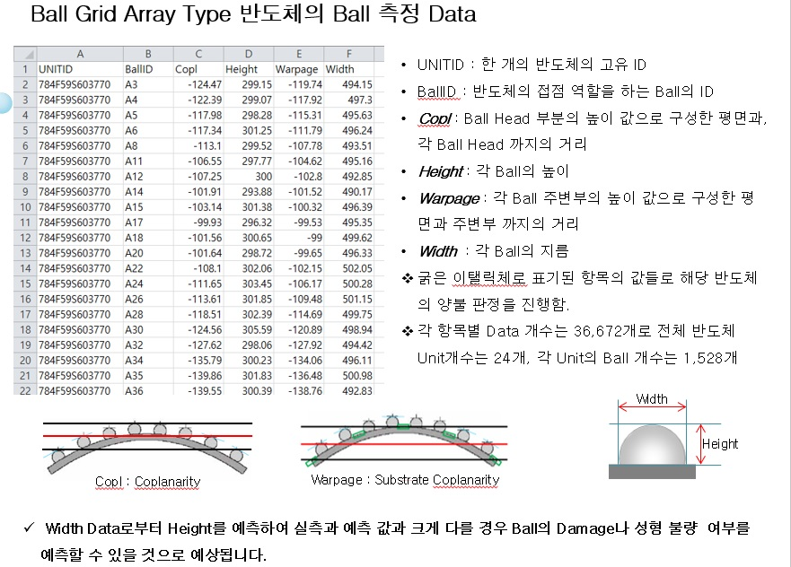
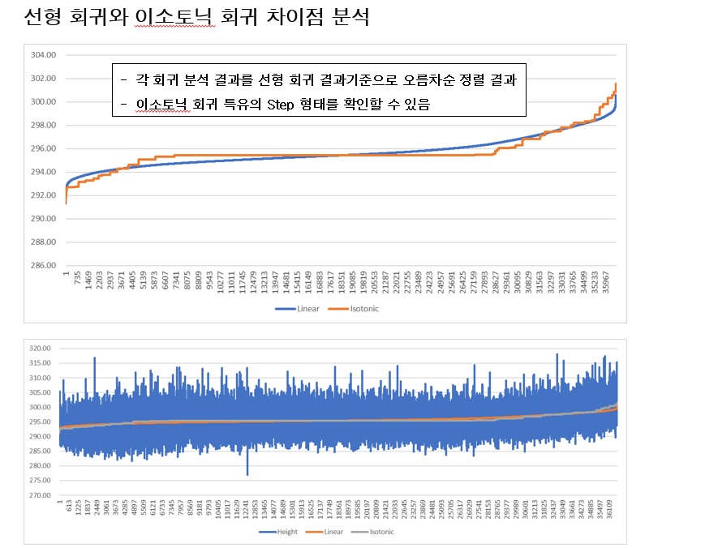

# ** 산업인공지능 개론 2nd Project** 

- 목표 : 현장의 Data를 사용하여 분류나 회귀 모델을 구현하시오. 
- 구현 : 선형 회귀와 이소토닉 회귀로 BGA Type 반도체 Ball Width로 Ball Hieght를 예측한 후 예측값과 실측 값의 차이로 Ball Damage, 성형 불량을 예측
   + CFLU_Data.csv : CFLU Package의 2D/3D 측정 결과(Unit개수는 24개, 각 Unit의 Ball 개수는 1,528개, Ball 전체 개수는 36,672개)
   + CFLU_Data_Regression.csv : 각 회귀 결과를 정리한 파일
   + Mini Proj02_이효중_선형및이소토닉회귀적용.pptx : 결과 Report
   + Mini_Proj02.py : Code

[개발 계획]

  
[실행 결과]

 

 

 