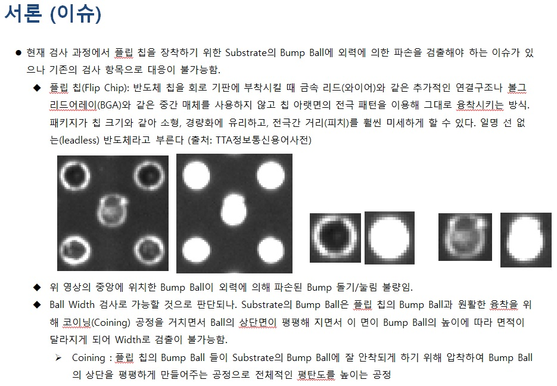

# ** 프로젝트 11, 12주차 진행 사항 보고 ** 

- 컴퓨터정보통신연구소 논문 준비
    + 제목 : 반도체 검사 장비에서 Bump 돌기/눌림 검출력 개선
    + 부제 : 경계부 변화량을 이용한 BGA 반도체 Bump의 돌기 및 눌림 불량 검사
    + 세부 사항
       + 반도체 공정 중 Coining 과정에서 발생하는 Bump의 돌기 및 눌림 검사 개선 방안
       + Coining 공정 : Solder Ball을 압착하는 공정으로 Bump들의 평탄도를 개선하는 과정
       + 이때 이 과정에서 발생하는 Bump의 돌기/눌림의 경우 기존의 검사항목으로 검출이 불가능함
       + 이에 Bump의 경계와 Bump의 중심의 거리 변화량을 확인하는 알고리즘 제시

  
[서론]

 

[1차 시도]

 

[신규 알고리즘 개념]

 

[신규 알고리즘 수식 및 결과]

 

 

 