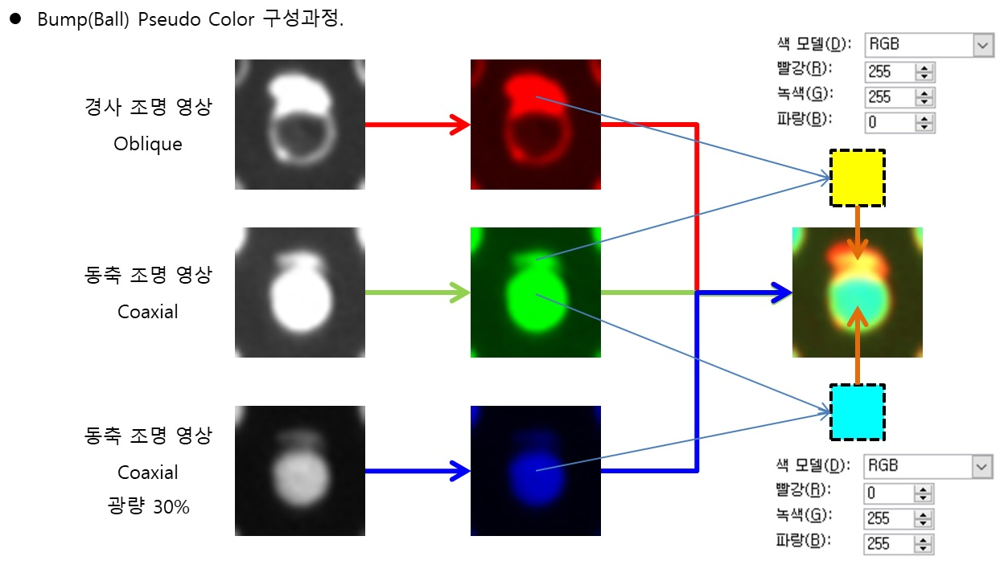
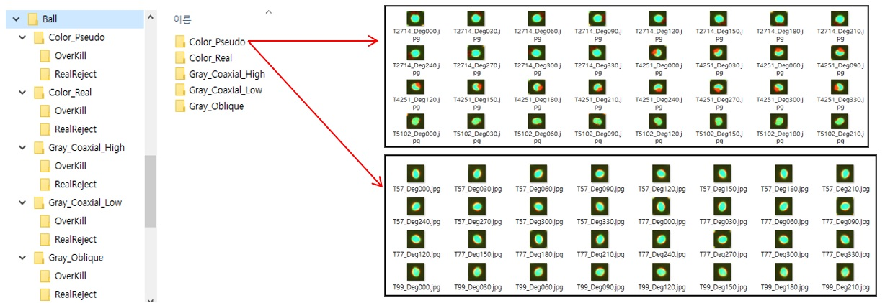

# ** 프로젝트 7주차 진행 사항 보고 ** 

- Bump 돌기(눌림) 불량의 각 Type 별 영상 생성 및 저장
- Bump(Ball) 실제 불량을 모두 검출 가능하도록 검사 Spec을 강화하여 검사 진행
    + 실제 불량 27개, 과검출 205개 발생. (총 Bump의 개수는 7170개)
- 검사 알고리즘에서 불량 판정한 Bump의 영상을 32x32 Size로 아래와 같이 분류하여 각각 30˚씩 회전하며 저장.
    + Group 1 : Pseudo Color Image.
    + Group 2 : Real Color Image.
    + Group 3 : Gray Image Type1 (경사 조명 영상).
    + Group 4 : Gray Image Type2 (동축 조명 영상).
    + Group 5 : Gray Image Type3 (동축 조명 영상. Type2 대비 광량 30% 수준).
    + 각 Group별 실제 불량 영상 324개, 과검출 영상 2460개

- 다른 불량 유형의 경우 충분한 영상 수집이 어려워 Bump 돌기(눌림) 불량만 이번 학기 동안 진행 예정
- 차주부터 각 영상 Group별로 ResNet-18로 Test 진행 예정
    + 학습용 영상과 검증용 영상 분류 필요 

[진행 상황 - Pseudo Color Image 생성 과정]

 

[진행 상황 - 각 Group별 영상 Set 구성]

 
 

 

 
